# EXPRESSION AND GENDER RECOGNITION SOFTWARE

## Mehul Kohli, Alexander Constant

### I. INSTRUCTIONS FOR EXECUTING THE CODE FILES

### II. ABSTRACT

This paper describes the creation and implementation of two Convolution Neural Network models for gender and expression recognition. The models were trained using the publicly available IMDB and FER-2013 datasets, for gender and facial expression respectively. We implemented Haar cascade facial detection in order to ensure that models did not attempt to predict on frames without faces. We report 95% validation rate for gender recognition in the IMDB dataset and 60.12% validation for expression recognition in the FER-2013 dataset. In addition, we found the FER-2013 expression dataset had a significant sample size imbalance, and we have trained three models for expression recognition: one with the imbalanced label included (“Disgust”), one with images labeled “Disgust” removed, and one with images labeled “Digust” removed and the remaining training data normalized to 4,000 images per class. Our implementation of these CNNs differs from others in the specific architecture of the neural network, and the removal of the imbalanced “Disgust” label and the  normalization of the remaining training data suggests an area for improvement for other models training with the FER-2013 dataset.

### 1. INTRODUCTION

Facial recognition is a fast growing segment of the software industry, and has applications ranging from security to implementations in social media tagging to healthcare. Oftentimes, it is useful to ascertain certain information about a face, such as age, gender, facial expression, and ethnicity. In recent years, the rise of Convolutional Neural Networks (CNNs) for image classification has proved useful for categorizing images, and facial recognition implementations have been at the forefront. Companies like Affectiva [1] offer expression recognition services at cost, and have models trained on large, proprietary datasets.
The publicly available IMDB gender and FER-2013 emotion datasets are among the most popularly used datasets for training gender and expression recognition CNNs for non-professional use. In-dataset validation accuracies for these datasets typically range up to 96% (gender, IMDB dataset) and ~65% (expression, FER-2013 dataset).

### 2. RELATED WORK

As facial and expression recognition is a fast growing field, there are a large number of approaches to developing CNNs for facial recognition purposes, and each approach is highly dependent of the desired end use of the trained model. For example, models used in real-time applications, such as robotics, tend to need to be smaller and more streamlined, such that there is not much delay between the reading of an input image and classification predictions. Models like those developed in [2] tend to value maximizing the ratio of accuracy over parameters by using Global Average Pooling operations. Another approach, taken in [6], is to first preprocess images by cropping the face and extracting Facial Parts – more specifically, the eyes and the mouth – then training two separate CNNs on the specifically extracted facial parts and combing their outputs in order to perform classification. This limits the total number of trainable parameters necessary.
In other cases, it is desirable to be able to train to higher accuracies while using smaller datasets. Models like those studied in [3] use “Scale Invariant Feature Transforms” in combination with CNNs in order to maximize validation accuracies over smaller datasets.
In all applications, it is desirable to reduce total training time and to simplify the specific implementations of the CNN in order to make working with such large statistical models less unwieldy. [5] proposes performing a batch normalization procedure between layers, which is used to normalize the inputs to each layer. This is necessary because as training proceeds, shifting network parameters create changing distributions of internal nodes in the network, which creates a need to precisely handle each layers inputs. Batch normalization removes this need, which accelerates training times. We use the batch normalization implementation that has been built into TensorFlow.

### 3. EXPERIMENTAL PLATFORM

Models were trained on a laptop with the following specs:

 - **GPU Specs**: Nvidia GeForce GTX 1050
 - **Cuda Cores**: 640
 - **Graphics Clock**: 1354 MHz
 - **Total available graphics memory**: 8134 MB
 - **Shared system memory**: 4038 MB
 - **Laptop**: HP Pavilion Power cb052tx
 - **RAM**: 8 GB

### 4. METHODOLOGY

##### 4.0 Ongoing Image Reclassification and Datasets

For both the IMDB and FER-2013 datasets, a number of images were observed to be misplaced, corrupted, or otherwise unusable. This is especially evident in the FER-2013 dataset. Throughout the project the reclassification of mislabeled images was an ongoing effort, although with tens of thousands of images in each dataset, it remained a concern even once the final models were obtained.

**Figure 4.0.1** and **Figure 4.0.2** show selections from the IMDB and FER-2013 datasets respectively. Both are publicly available and widely used for gender and expression recognition models. Images in the IMDB dataset are of all sizes, and had to be converted to grayscale 128x128 before being used for training. Images in the FER-2013 dataset are 64x64 grayscale, and require no preprocessing before. The IMDB dataset has an implicit bias built in (which will be discussed a bit more later), in that it primarily comprises white, western actors. This leads to a gender recognition model that will likely perform better on white subjects with western features.

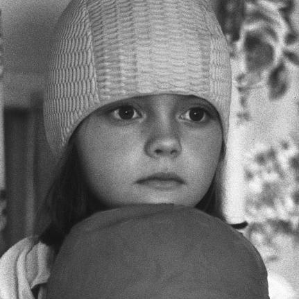 
 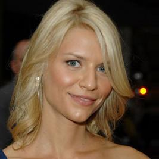
> **Figure 4.0.1 (a) Gender Dataset - IMDB: Female Images Preview**

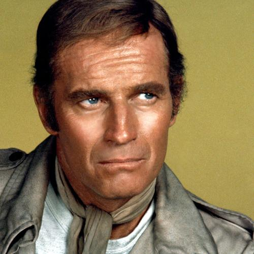 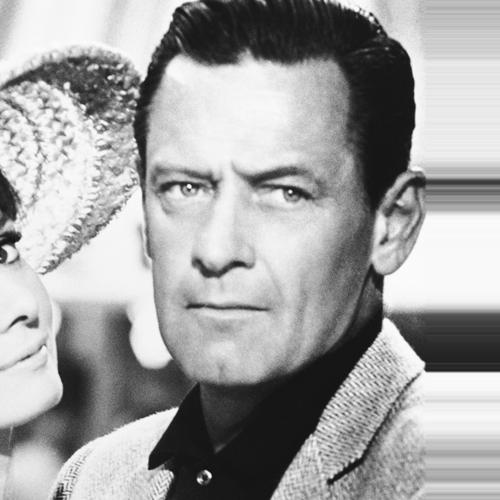
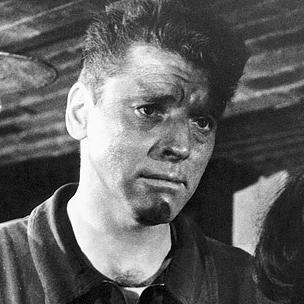 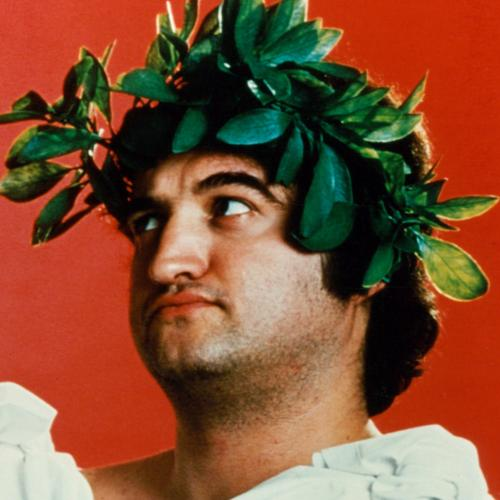
> **Figure 4.0.1 (b) Gender Dataset - IMDB: Male Images Preview**

     
> **Figure 4.0.2 (a) Emotion Dataset - FER2013: Anger Images Preview**

     
> **Figure 4.0.2 (b) Emotion Dataset - FER2013: Disgust Images Preview**

   
  
> **Figure 4.0.2 (c) Emotion Dataset - FER2013: Neutral Images Preview**

   
  
> **Figure 4.0.2 (d) Emotion Dataset - FER2013: Fear Images Preview**

   
  
> **Figure 4.0.2 (e) Emotion Dataset - FER2013: Sad Images Preview**

   
  
> **Figure 4.0.2 (f) Emotion Dataset - FER2013: Happy Images Preview**

   
  
> **Figure 4.0.2 (g) Emotion Dataset - FER2013: Surprise Images Preview**

##### 4.1 Gender Recognition Model

The gender recognition model architecture is shown in Figure 4.1. The architecture was designed iteratively, using TensorFlow [6]. We began with a small model of only a few layers, and layers were added and subtracted as the model was tested. Generally, convolutional layers (conv2D) attempt to recognize features of the input image by convoluting the image with various kernels. Max-pooling layers attempt to compress the image (conventionally by ½) while maintaining the features detected by the preceding convolutional layer. Dropout layers attempt to combat overfitting by ignoring randomly chosen nodes within the preceding layer. The idea is to prevent sets of interdependent weights from being included in the final model – essentially, Dropout “forces” nodes to interdependent patterns. The flatten layer simply turns pooled feature map, created by recognize individual patterns, not a convolutional and max-pooling layers, into a 1-dimensional vector. Dense layers are where the “neurons” of the neural networks are. This model was then trained on the IMDB dataset using standard back-propagation over 30 epochs. A 75-25% training-testing data split was used. The final model weights returned after training were the weights of the network when minimum validation loss was reported – in this way, we were able to train the model over more epochs than necessary, which eliminated the need to train the model multiple times  while guessing at the necessary number of epochs to minimize loss.

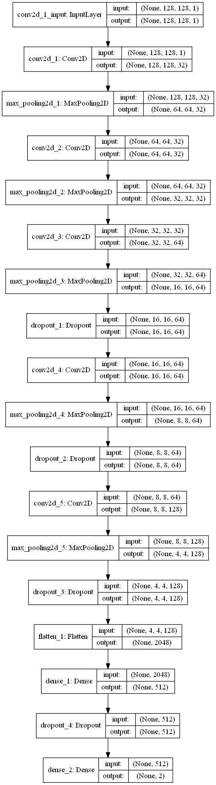

> **Figure 4.1: Gender Recognition Architecture**

##### 4.2 Expression Recognition Model with “Disgust”

The publicly available FER-2013 emotion dataset is one of the more commonly used emotion recognition datasets for training expression recognition models, and has seven classification categories: “Anger”, “Fear”, “Disgust”, “Happy”, “Neutral”, “Sad”, and “Surprise”. However, these categories contain highly variable numbers of images: from 567 in the “Disgust” category to 9299 in the “Happy” category. Machine learning in CNNs is highly dependent on having roughly equal sizes of classification categories – otherwise, a model may simply learn to not classify an image as belonging to a category because it was trained on far fewer images of that category, and in order to minimize loss it learned a bias against that category in general. The opposite case can be true of categories with larger numbers of images. Therefore, once we had created an architecture that we were satisfied with, we trained three different models: one with all the images in the FER-2013 dataset, one with the extremely underpopulated “Disgust” label removed, and one with the “Disgust” label removed and the numbers of all other training categories normalized to exactly 4000 images each. The architecture of the network is shown **on the right**. It includes a number of the features present in the gender recognition architecture, as well as the inclusion of a new feature, a Batch Normalization layer, as discussed in the **Related Work** section. This layer helps in reducing training time for the network, but also has marginal effects on decreasing validation loss in general.

There is a single difference the architectures of used for the three models: the output layer for Model 1 (full dataset) had an output layer with 7 nodes (one corresponding to each label), while the architectures used for the datasets with “Disgust” removed had 6 nodes in the output layer. For the first model (Model 1), this architecture was trained on the full FER-2013 dataset. As with the gender model, a 75-25 training/testing data split was used. Weights were returned when validation loss was roughly minimized (more on this below). Each of the following models were trained using back propagation over 100 epochs each.

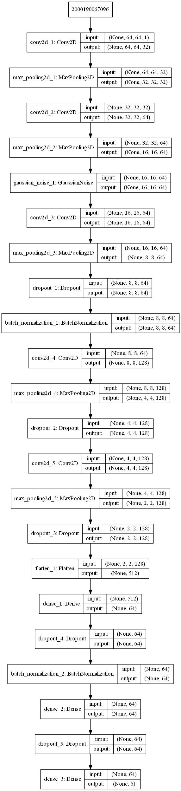

**Figure 4.2:** Expression Recognition Architecture

##### 4.3 Expression Recognition Model without “Disgust” Label (Model 2)

Because the “Disgust” label was severely underpopulated, we decided to train the architecture in 4.2 on the FER-2013 dataset without the “Disgust” label, which, as will be seen later, was not particularly successfully learned by expression Model 1. As before, this model was trained over 100 epochs and weights were saved when minimum validation loss was recognized.

##### 4.4 Expression Recognition Model without “Disgust” Label & with Normalized Datasets (Model 3)

The final Expression Model was trained without images in the “Disgust” category and with all other category sizes normalized to 4000 images each. As before, it was trained over 100 epochs and weights were saved when minimum validation loss was achieved.

##### 4.5 Additional Tests

In addition to the standard tests performed by the CNN as it is trained, an additional set of “eye tests” were performed on videos with known gender/expression data. The results of these tests were judged by the perceived accuracy with which the model was able to detect the intended gender/expression of the subject image. 

### RESULTS

##### 5.1 Gender Recognition Model Results

Our gender prediction model reported a validation accuracy of 95.04% on the IMDB gender dataset. TensorFlow callbacks were used to save the network’s weights when the validation testing loss was observed to be at a minimum, which occurred after 16 epochs of training. In epochs 19-30, training set validation loss continued to fall, but testing set validation loss rose slightly, indicating that the model was becoming overfit. Figure 5.1 is the graphical representation of the loss and accuracies achieved in the IMDB dataset for the gender model.

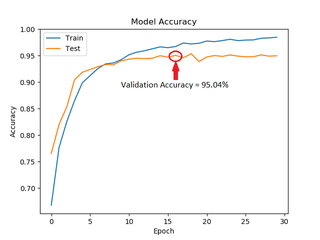 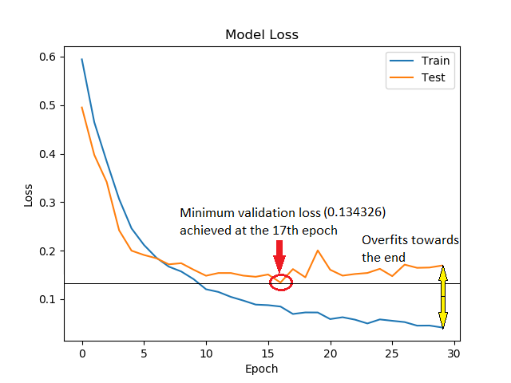

> **Figure 5.1 Gender Recognition Accuracy & Loss Stats**

##### 5.2 Expression Model 1

Our first expression recognition model (Model 1) achieved a validation accuracy in the FER-2013 emotion dataset of 60.10%, which was achieved after 33 epochs of training. Figure 5.2 below shows the model’s loss and accuracy for each epoch of training. The network weights present during minimum validation loss were saved.

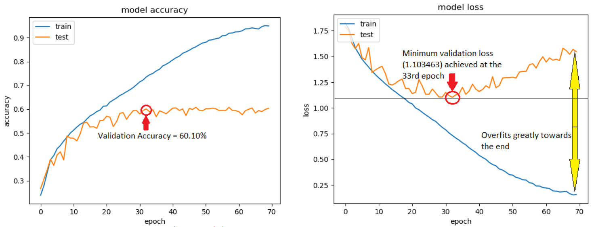

> **Figure 5.2.1 Expression Model 1 - Accuracy & Loss Stats**

In the case of a network trained on imbalanced data sets, such as the FER-2013 emotion dataset, it is worthwhile to examine the model’s confusion matrix over the dataset. The confusion matrix is an n x n matrix, where n is the number of classification categories in the network. Each row of the matrix represents a model’s predicted classification, and each column represents the labeled (known) classification. For each image in the dataset, the model predicts the image’s classification, and increments the number of images in the cell corresponding to the predicted classification (row) and the known classification (column). A perfect model’s confusion matrix would be diagonal, which would indicate that for all images the predicted classification matched the known classification. However, this could also represent overfitting of the model to the training data, if that same training data is used for the classification tests.

The confusion matrix is a useful tool for determining which classifications a multi-class model is particularly strong at, and which classifications it is weak at. Below are two confusion matrices (Figures 5.2.2 and 5.2.3) for Expression Model 1, one with image totals (to demonstrate the imbalanced size of the dataset classes) and one where each cell is a percentage representing the percentage of images in the column’s class (the known class) that the model predicted as belonging to the row’s predicted class. This percentage is calculated by dividing each cell’s number in the first confusion matrix by the sum of that cell’s column.

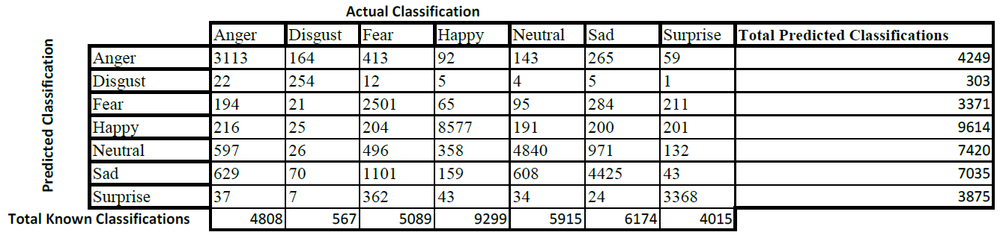

> **Figure 5.2.2 Expression Model 1 - Confusion Matrix (Image totals)**

As can be seen in the above confusion matrices, the model predicts “Happy”, “Neutral” and “Surprise” fairly well, with 80%+ of images labeled in those categories predicted as belonging to their respective category. The model particularly struggles with the “Disgust” and “Fear” labels: images with those labels were classified correctly less than 50% of the time. It appears that the model is particularly confused by images labeled as “Disgust”, “Fear”, and “Sad”. Almost 30% of images labeled “Disgust” were misclassified as “Anger” and 12% were misclassified as “Sad”. Roughly 22% of images labeled “Fear” were misclassified as “Sad” and 15% of images labeled “Sad” were misclassified as “Neutral”. The confusions between “Disgust”, “Fear” and “Sad” are perhaps not surprising, as the three expressions have quite a bit of overlap. The model’s biases may be seen by comparing the predicted classification totals to the known classification totals, as in the last column and last row of the confusion matrix in Figure 5.2.3.. For  example, the model predicted 303 images as belonging to the classification “Disgust”, but there were 567 images that belonged to this classification in the dataset. This indicates that the model is biased against predicting an image as belonging to the “Disgust” classification – this is probably due to the imbalance in the relative number of “Disgust” images in the FER-2013 dataset: there are 567 total “Disgust” images, and the next smallest number is the “Surprise” label with 4015. This means that the model likely learned a bias against classifying an image as “Disgust” because it was simply trained on far fewer “Disgust” labeled images. Model 3 attempts to correct this imbalance (see **Section 5.5**).

The model is biased towards classifying images as “Neutral” in spite of the fact that the “Neutral” label has a similar number of images as other labels. Again surprisingly, the model does not appear biased towards “Happy” although that label has, by a large margin, more images than any other label. This is, perhaps, due to images labeled “Happy” having an easily noticeable feature that the network likely picked up on: a smile, especially one with teeth showing.

**5.4 Expression Model 2**

The second expression model (Model 2) was trained without any images labeled “Disgust” due to reasons mentioned prior. It achieved a validation accuracy of 61.30% on the reduced dataset after 73 epochs. Figure 5.4.1 to the right shows a graph of the models accuracy over 100 epochs, and Figure 5.4.2 is a corresponding graph for validation loss.

**Figure 5.4.1** Expression Model 2

Validation Accuracy

**Figure 5.4.2** Expression Model 2

Validation Loss

The slight increase in validation accuracy comes at the expense of the model no longer being able to detect “Disgust” at all, so simply reporting improved accuracy does not tell the whole story, especially because this accuracy is with respect to the reduced dataset, in which there are no more “Disgust” images at all. A different view of the model can be seen by creating confusion matrices for this model over the whole, unaltered dataset. In this way we can see whether removing the “Disgust” label tends to improve accuracy in detecting other facial expressions. Figures 5.4.3 and 5.4.4 below and on the following page are the two confusion matrices for Expression Model 2.

The “Disgust” row of both matrices is empty, showing that the model no longer predicts the “Disgust” expression. It is instructive to compare these two matrices to the matrices in Figures 5.3.4 and 5.3.5. It is noticeable that, aside from “Fear” and “Anger”, Expression Model 2 had reduced true positive percentages across the board. However, the reductions are minimal. What is also noticeable is that this model seems to have less of a bias towards predicting “Neutral” than Model 1 overall. In Model 1, “Neutral” was predicted 7420 times, compared to the actual number of “Neutral” images, 5915. Model 2 does not seem to have this bias – it predicted “Neutral” 5714 times. However, the model did demonstrate a rather noticeable bias towards predicting “Sad”: Model 2 predicted “Sad” 8468 times, compared to the actual number of “Sad” images, 6174. The predicted number of “Happy” images and “Anger” images matched up very well with total numbers of images for those respective categories. However, especially in the “Anger” category, this is largely due to a large number of false positives that just happen to add up nicely.

It is important to remember that this model is trained differently from the ground up, so this is not simply the result of “Disgust” predictions being moved elsewhere – instead, it is a completely different model than Expression Model 1. Here it is probably important to mention that, throughout this experiment, we are dealing with a dataset that has quite a number of mislabeled images. We’ve done our best as a group to fix these mislabels, but it is very difficult to go through ~35,000 images and ensure that all images are in their correct folders. That is why, although validation accuracies and confusion matrices tell important stories about the way a model *thinks* it performs on the dataset, the final effectiveness of the model is really determined by its performance in real-world tests, such as those that will be described in 5.6. For example, a face that is clearly “Sad” to most human observers may be found in the “Happy” dataset (and upon investigation this is not too uncommon an occurrence). A model may find this expression to be “Sad,” but because it is located in the “Happy” category, this will be reported as incorrect. Of course, the model is trained from the ground up on this dataset, so it is likely being misled as it trains over these images in the first place.

**5.5 Expression Model 3**

For our final expression recognition model, we removed the “Disgust” labeled images and trained over 4000 images each of the remaining classifications. This was an attempt to reduce the inherent bias learned by Model 1 towards classifying images as belonging to classifications that had larger numbers of training images. Figures 5.5.1 and 5.5.2 below are the graphs showing validation accuracy and validation loss for this model over 100 epochs of training. This model achieved a lower validation accuracy than the previous models: 57.2%, achieved at the 83rd epoch.

**Figure 5.4.1** Expression Model 3

**Figure 5.4.2** Expression Model 3

Validation Accuracy

Validation Loss

Of course, for reasons mentioned earlier, it is not enough to simply take the model’s word for how well it performs, as the dataset itself is flawed. Figures 5.4.3 and 5.4.4 below and on the following page are the confusion matrices for Expression Model 3.

Model 3 seems to introduce a significant drop in the consistency of “Happy” images being classified as “Happy,” when compared to the previous two models. Additionally, it appears to have a bias towards classifying images as “Angry.” However, it demonstrates a significant gain in classifying images labeld as “Surprise” correctly – in fact, this is the only model in which “Happy” wasn’t the most validated classification.

**5.6 Additional Test Results**

As mentioned before, all results for the Gender Model and the three Expression Models are reflecting their success within their datasets. For the Gender Model, this appears to be a non-issue: the IMDB dataset, although imperfect, appears to have much more consistency than the FER-2013 dataset. Because of the inconsistency of the FER-2013 dataset, a model reporting that it is excellent within the dataset may be flawed in real-life classification. For this reason, we conducted a number of “eye-tests” to subjectively determine how the Expression Models perform. For these tests, Alex took a number of photos of himself making expressions, and passed those images to each of the expression models to classify.

These expressions are in figure 5.6.1 below:

**Figure 5.6.1** Eye test images, from left to right: Angry, Fearful,

Happy, Neutral, Sad, and Surprised

The classifications determined by each model are shown in figure 5.6.2 below:

Expected Expression

Angry

Model 1 Neutral

Model 2 Angry

Model 3 Neutral

Fearful

Neutral

Angry

Happy

Happy

Happy

Happy

Neutral

Neutral

Neutral

Neutral

Sad

Neutral

Sad

Surprised

Surprised

Surprised

Surprised

Fearful

Neutral

Model 2 seemed to trend towards classifying things as “Angry” and “Sad”. Model 3 was the only Model with which we could achieve reasonably consistent results with “Fearful” expressions not in the FER-2013 dataset. Disgust was not included in this test, as we were unable to achieve a “Disgust” categorization from Model 1 over many attempts, including live video with frame-by-frame measurements. This is unsurprising, as Model 1’s confusion matrix showed a clear reluctance of the model to classify any input image as “Disgust”.

We were, however, able to get Model 1 to classify a number of the images in the “Disgust” classification of the FER-2013 datset as “Disgust”. Figure 5.6.3 below shows three of these images and their reclassifications in Models 2 and 3.

Image

Model 1 Model 2 Model 3

Image 1 Disgust

Image 2 Disgust

Image 3 Disgust

Fear

Sad

Fear

Fear

Sad

Fear

Image 1

Image 2

Image 3

**Figure 5.6.3**: “Disgust” images and reclassifications

It seems as though Models 2 and 3 tend to reclassify “Disgust” images as either belonging to Fear

or Sad. Compiling the “Disgust” columns of the percentage classification matrices from each

expression model demonstrates how images labeled “Disgust” are reclassified by Models 2 and 3.

The compiled columns are in Figure 5.6.4 to the right.

**Classification of Disgust Images**

(% of Images Labeled)

Model 1 Model 2 Model 3

It seems to be the case that the majority of “Disgust”

labeled images are reclassified into “Fear” and “Sad”,

with a lower percentage being reclassified into

“Angry”. This seems reasonable – expressions of

“Disgust” share a fair amount of overlap with

epressions of fear, anger, and sadness.

Angry

Disgust

Fear

Happy

Neutral

Sad

28.92

44.8

3.7

36.33

0

17.64

5.82

5.82

31.75

2.65

38.62

0

23.28

7.58

5.47

21.87

3.17

4.41

4.59

12.35

1.23

Surprise

**Figure 5.6.4** Classwise Disgust Classifications

17

Additional classwise confusion vectors for each of the 7 expressions in the FER-2013 datset are

available in Appendix II.

Finally, additional tests on the Solvay Conference image appear in Appendix I, as the images each

require their own page.

**5.7 Total Classification Percentages**

Another way to look at the performance of the model is to determine the percentage of each class

of image in the dataset as a whole, and then compare the total percentage of images fitting each

classification as predicted by the model. A model that predicts a a classification percentage that

matches the class’ percentage of the dataset as labeled does not mean that that model performs

better than another model. For example, our dataset may have 25% “Fear” images, and a model

may predict 25% of the dataset as falling under the label “Fear” – but if that model only predicts

10% of images labeled “Fear” as belonging to the “Fear” class, and 90% of “Neutral” labeled

images as belonging to the “Fear” class, then the model is obviously flawed. So, in order to

determine the performance of a model, a total percentage classification matrix needs to be

compared with each model’s confusion matrices, in order to determine whether a model actually

predicts well within its class, as well as as a whole. A matrix for total classification percentages is

is below, in Figure 5.7.1.

**Total Classification Percentages (35864 total Images)**

Actual

13.41

Model 1 Model 2 Model 3

Angry

Disgust

Fear

Happy

Neutral

11.85

0.84

13.39

0

15.43

0

1.58

14.19

25.93

16.49

17.22

11.2

9.4

9.84

12.95

23.68

17.45

18.36

12.15

10.14

26.81

20.69

19.62

10.8

25.88

15.93

23.61

11.36

13.11

Sad

Surprise

Total Difference

N/A

14.97

**Figure 5.7.1** Total Classification Percentages

The total difference row at the bottom sums the differences between the actual and model predicted percentages for each model. Perhaps surprisingly, Model 3, which seemed to perform worse within each category (except for “Surprise”) had a total summed difference from the actual percentages for each classification almost 3% smaller than the other two models. This could indicate a few things. Firstly, it is an indication that the attempt to normalize the dataset led to real results – overall, Model 3 predicts globally in much closer percentages to the global percentages for each expression in the dataset. However, Model 3 predicts less accurately within each expression class, as can be seen in its confusion matrix in figure 5.5.3. Additionally, Model 3 overpredicts “Sad” when compared to the actual percentage of “Sad” images in the dataset. This leads us to the conclusion that although the model was less biased by imbalanced input percentages (as it was trained on 4000 images each of all categories except “Disgust”), it was also unable to learn useful classifiers for each expression, and instead tends to spread its classifications out uniformly across “Angry”, “Fear”, “Neutral”, “Sad”, and “Surprise”. It performs similarly to the other Models in the “Happy” classification, but that is, as mentioned before, likely due to the ease of recognizing a toothy smile, which is a very definitive feature. Overall, it is difficult to tell which model truly performs better. Because all these results come from within the FER-2013 dataset, true testing of these models must be performed in real-time, by real people, over a large period, in order to determine which model really performs best. This is where the implementation software comes in.

**5.8 Implementation Software**

Software was created that allowed for ease of testing models on live and prerecorded videos, as well as on images. Users select from the three expression models to use when performing recognition. For each frame of an input video, whether live or prerecorded, and input photos, an OpenCV [6] implementation of Haar cascade facial recognition detects faces in the frame, and each detected region is passed to both the gender model and the chosen expression model, which perform prediction and write those predictions, along with their confidence levels, back onto the frame, along with a rectangle around the detected face. The user may choose to save videos and images with predictions written onto the frame.

Additionally, the software tracks statistics for images, compiling how many men and women were detected, as well as the total number of people with each type of facial expression and more specific stats, including confidences, for each face detected. The user may choose to save these stats as a text file.

**Discussion**

Our objectives in creating these models were to meet certain self-set standards for validation accuracy within each database. Our stated goal of achieving a 95% validation accuracy within the IMDB dataset for Gender Recognition was met, albeit barely. One concern is that the gender model only attests to the existence of two genders: “Man” and “Woman”.  Therefore, the model is unable to predict non-binary or other-gendered individuals – in order to rectify this oversight, a dataset with more gender label types should be created or found. We were unable to meet our stated goal of 65% validation accuracy in the FER-2013 dataset for expression recognition. Initially, this number was chosen as it roughly mirrored the numbers achieved in [2] (66%) and [3] (73.4%), with room to account for the extra features those networks utilized. However, expression recognition is an inherently subjective field: two people may interpret the same facial expression very differently, as can be seen by the perceived inconsistencies in the FER-2013 emotion dataset. This was the reason we created three different Expression Recognition Models. Although a model may report lower accuracy scores within the FER-2013 dataset, it is always possible that the model will perform better in real applications. 

The ultimate stated goal of creating gender and expression recognition software was met, as the models are implemented smoothly within a basic terminal UI that allows for live video recording, photo taking, as well as processing of already recorded videos and already taken photos. There is additionally likely a bias in the gender recognition model towards western facial features, as the IMDB database is predominated by western, and more specifically white American actors. This could be tested by attaining datasets with more ethnic and racial diversity and comparing confusion matrices.

**Conclusion and Future Work**

This paper describes the creation and implementation of four CNN models using two different CNN architectures. The architectures were custom built over many iterations in an attempt to create ideal networks to perform gender and expression recognition tasks. Once two architectures were decided upon, they were trained on the IMDB dataset (gender network) and the FER-2013 dataset (expression network).The gender recognition model achieved 95% validation accuracy in the IMDB dataset.

The three expression recognition models achieved corresponded to 3 different versions of the FER-2013 dataset. The FER-2013 dataset has varying numbers of images in each classification category, but the “Disgust” category in particular is an order of magnitude smaller than other categories. Therefore, we created 3 models. The first model corresponded to the expression recognition architecture being trained on the whole FER-2013 dataset. The second model corresponded to the model being trained on the whole FER-2013 dataset with all images labeled “Disgust” removed. The final model was trained on the FER-2013 dataset with all images labeled “Disgust” removed and the remaining labels normalized to 4000 images each. Validation accuracies of 60.10%, 61.30%, and 57.2% for each model respectively were achieved. Each of these models were implemented into software that allows for user input to select live video recognition, recognition on pre-recorded videos, and recognition on photos. The user may select between any of the three expression recognition models. The program compiles statistics about predictions for videos and photos and displays them to the user upon request, and allows the user to save these statistics to a text file.

This work could be expanded in many ways. In the future, the expression recognition models could incorporate the extra, more complex features in [3] and [5] in an attempt to increase their accuracies. Alternatively, the current models could each be further trained on different, more expansive datasets in an attempt to offset some of the biases introduced by the IMDB and FER-2013 datasets. The approach to training Expression Model 3 seems as though it would be well tailored to the addition of SIFT network features as in [3]. SIFT features specifically allow for improved training on smaller datasets – a model trained over 500 images of the FER-2013 dataset with “Disgust” included may prove to be a valuable approach, as it allows for normalization of the training set while retaining the “Disgust” labeled images. This was ineffectual in our implementation, as 500 images was simply not enough to achieve accuracies any higher than chance.

The final software could be improved to compile stats for videos with multiple people detected. Currently, the software cannot detect whether a person seen in one frame was in the previous frame, so stats collected on videos where multiple people are detected are not reliable in any way. Additionally, the software could implement the models in a more complete way that allows the user further train the models using their own datasets if they so choose.

##### REFERENCES

[1] Affectiva.com (n.d.). Retrieved March 13, 2019, from <https://www.affectiva.com/product/affdex-for-market-research/>

[2] Arriaga, Plöger, and Valdenegro. (20 Oct 2017). Real-time Convolutional Neural Networks for Emotion and Gender Classification. Retrieved March 13, 2019 from https://arxiv.org/pdf/1710.07557.pdf.

[3] Connie T., Al-Shabi M., Cheah W.P., Goh M. (2017) Facial Expression Recognition Using a Hybrid CNN–SIFT Aggregator. (19 Oct 2017). Retrieved March 13, 2019 from (https://arxiv.org/ftp/arxiv/papers/1608/1608.02833.pdf)<https://arxiv.org/ftp/arxiv/papers/1608/1608.02833.pdf>[.](https://arxiv.org/ftp/arxiv/papers/1608/1608.02833.pdf)

[4]Sergey Ioffe and Christian Szegedy. Batch normalization: Accelerating deep network training by reducing internal covariate shift. (11 Feb 2015). Retrieved March 20, 2019 from (https://arxiv.org/abs/1502.03167)<https://arxiv.org/abs/1502.03167>[.](https://arxiv.org/abs/1502.03167)

[5]Nwosu et al. Deep Convolutional Neural Network for Facial Expression Recognition using Facial Parts. (2017) Retrieved March 25, 2019 from <https://sceweb.uhcl.edu/xiaokun/doc/Publication/2018/ICPI2018_Lucy.pdf>

[6] OpenCV. OpenCV (Open Source Computer Vision Library). Retrieved March 13, 2019, from https://www.opencv.org

[7] TensorFlow. TensorFlow. Retrieved March 13, 2019, from https://tensorflow.org

##### APPENDIX I: Solvay Test Image and Results**

Each expression model was tested on this famous picture from the 1927 Solvay International Conference on Electrons and Photons. The gender model correctly identified the lone woman in attendance, Marie Curie (third from left, first row). However, it incorrectly classified two men on the far right as women. The Haar cascade failed to recognize the man 5th from the left in the back row. On the following pages are larger versions of the above picture with gender and emotion predictions written on the image.

Model 2, the “Angry Model” seems to believe a majority of these physists are angry, while Model 3 shows a wider variation than Model 1. Of course, most faces in this image would be, by a human observer, likely classified as “Neutral”. To this end, it appears Model 1 performs the best.

Below are stats for each face in the Solvay image for each model. Refer to the number in the upper righthand corner of each face in the image to determine the person to whom each stat refers. Numbers are consistent across images.

**Model 1:**

Predicted number of people

feeling each emotion:

Angry: 4

Disgusted: 0

Fearful: 0

Person 7:

Person 16:

Person 25:

Predicted emotion: Neutral

Confidence: 0.49055684

Predicted gender: Woman

Confidence: 0.7069004

Predicted emotion: Neutral

Confidence: 0.8950767

Predicted gender: Man

Confidence: 0.9850332

Predicted emotion: Neutral

Confidence: 0.42531762

Predicted gender: Man

Confidence: 0.9539334

Happy: 1

Neutral: 20

Sad: 3

Surprised: 0

Person 8:

Person 17:

Person 26:

Predicted emotion: Neutral

Confidence: 0.6157285

Predicted gender: Man

Confidence: 0.9635548

Predicted emotion: Angry

Confidence: 0.47764555

Predicted gender: Man

Confidence: 0.8227861

Predicted emotion: Neutral

Confidence: 0.6040195

Predicted gender: Man

Confidence: 0.6660698

Predicted number of men

and women:

Women: 3

Person 9:

Person 18:

Person 27:

Predicted emotion: Sad

Confidence: 0.39347428

Predicted gender: Man

Confidence: 0.9247081

Predicted emotion: Neutral

Confidence: 0.688051

Predicted gender: Man

Confidence: 0.9274997

Predicted emotion: Neutral

Confidence: 0.41532916

Predicted gender: Man

Confidence: 0.99652475

Men: 25

Specific predictions for

faces

Person 1:

Person 10:

Person 19:

Person 28:

Predicted emotion: Sad

Confidence: 0.82911897

Predicted gender: Man

Confidence: 0.89965886

Predicted emotion: Angry

Confidence: 0.45591182

Predicted gender: Man

Confidence: 0.98968554

Predicted emotion: Neutral

Confidence: 0.81104493

Predicted gender: Man

Confidence: 0.99322414

Predicted emotion: Neutral

Confidence: 0.7511657

Predicted gender: Man

Confidence: 0.9777784

Person 2:

Person 11:

Person 20:

Predicted emotion: Neutral

Confidence: 0.38324463

Predicted gender: Man

Confidence: 0.583637

Predicted emotion: Neutral

Confidence: 0.37726206

Predicted gender: Man

Confidence: 0.858431

Predicted emotion: Neutral

Confidence: 0.56490093

Predicted gender: Man

Confidence: 0.8976347

Person 3:

Person 12:

Person 21:

Predicted emotion: Neutral

Confidence: 0.49475875

Predicted gender: Man

Confidence: 0.98371613

Predicted emotion: Neutral

Confidence: 0.97203237

Predicted gender: Man

Confidence: 0.9391995

Predicted emotion: Angry

Confidence: 0.30943057

Predicted gender: Man

Confidence: 0.9910091

Person 4:

Person 13:

Person 22:

Predicted emotion: Neutral

Confidence: 0.64418554

Predicted gender: Man

Confidence: 0.93730545

Predicted emotion: Angry

Confidence: 0.38168204

Predicted gender: Man

Confidence: 0.6382759

Predicted emotion: Neutral

Confidence: 0.46732026

Predicted gender: Woman

Confidence: 0.52345

Person 5:

Person 14:

Person 23:

Predicted emotion:Neutral

Confidence: 0.8252429

Predicted gender: Man

Confidence: 0.9166301

Predicted emotion: Neutral

Confidence: 0.81468445

Predicted gender: Man

Confidence: 0.9243938

Predicted emotion: Sad

Confidence: 0.35242328

Predicted gender: Man

Confidence: 0.54669917

Person 6:

Person 15:

Person 24:

Predicted emotion: Neutral

Confidence: 0.7299552

Predicted gender: Man

Confidence: 0.9157927

Predicted emotion: Neutral

Confidence: 0.6989118

Predicted gender: Woman

Confidence: 0.97021514

Predicted emotion: Happy

Confidence: 0.7816232

Predicted gender: Man

Confidence: 0.89115417

27

**Model 2**

Predicted number of people

feeling each emotion:

Angry: 11

Fearful: 0

Happy: 2

Person 8:

Person 18:

Person 28:

Predicted emotion: Sad

Confidence: 0.36460364

Predicted gender: Man

Confidence: 0.9635548

Predicted emotion: Angry

Confidence: 0.4810425

Predicted gender: Man

Confidence: 0.9274997

Predicted emotion: Happy

Confidence: 0.81667113

Predicted gender: Man

Confidence: 0.9777784

Neutral: 12

Sad: 3

Person 9:

Person 19:

Surprised: 0

Predicted emotion: Angry

Confidence: 0.54171216

Predicted gender: Man

Confidence: 0.9247081

Predicted emotion: Neutral

Confidence: 0.39979565

Predicted gender: Man

Confidence: 0.99322414

Predicted number of men and

women:

Women: 3

Men: 25

Person 10:

Person 20:

Predicted emotion: Neutral

Confidence: 0.66110986

Predicted gender: Man

Confidence: 0.98968554

Predicted emotion: Neutral

Confidence: 0.8537583

Predicted gender: Man

Confidence: 0.8976347

Specific predictions for faces

Person 1:

Predicted emotion: Angry

Confidence: 0.38781524

Predicted gender: Man

Confidence: 0.89965886

Person 11:

Person 21:

Predicted emotion: Angry

Confidence: 0.5665451

Predicted gender: Man

Confidence: 0.858431

Predicted emotion: Neutral

Confidence: 0.5233646

Predicted gender: Man

Confidence: 0.9910091

Person 2:

Predicted emotion: Angry

Confidence: 0.59197474

Predicted gender: Man

Confidence: 0.583637

Person 12:

Person 22:

Predicted emotion: Neutral

Confidence: 0.57359236

Predicted gender: Man

Confidence: 0.9391995

Predicted emotion: Neutral

Confidence: 0.39326963

Predicted gender: Woman

Confidence: 0.52345

Person 3:

Predicted emotion: Angry

Confidence: 0.53505373

Predicted gender: Man

Confidence: 0.98371613

Person 13:

Person 23:

Predicted emotion: Neutral

Confidence: 0.81499916

Predicted gender: Man

Confidence: 0.6382759

Predicted emotion: Sad

Confidence: 0.4656638

Predicted gender: Man

Confidence: 0.54669917

Person 4:

Predicted emotion: Neutral

Confidence: 0.47026512

Predicted gender: Man

Confidence: 0.93730545

Person 14:

Person 24:

Predicted emotion: Sad

Confidence: 0.43899855

Predicted gender: Man

Confidence: 0.9243938

Predicted emotion: Happy

Confidence: 0.8730227

Predicted gender: Man

Confidence: 0.89115417

Person 5:

Predicted emotion: Neutral

Confidence: 0.5431332

Predicted gender: Man

Confidence: 0.9166301

Person 15:

Person 25:

Predicted emotion: Neutral

Confidence: 0.8102385

Predicted gender: Woman

Confidence: 0.97021514

Predicted emotion: Angry

Confidence: 0.7477751

Predicted gender: Man

Confidence: 0.9539334

Person 6:

Predicted emotion: Neutral

Confidence: 0.62726665

Predicted gender: Man

Confidence: 0.9157927

Person 16:

Person 26:

Predicted emotion: Angry

Confidence: 0.41582084

Predicted gender: Man

Confidence: 0.9850332

Predicted emotion: Neutral

Confidence: 0.57193285

Predicted gender: Man

Confidence: 0.6660698

Person 7:

Predicted emotion: Angry

Confidence: 0.809524

Predicted gender: Woman

Confidence: 0.7069004

Person 17:

Person 27:

Predicted emotion: Angry

Confidence: 0.6579678

Predicted gender: Man

Confidence: 0.8227861

Predicted emotion: Angry

Confidence: 0.73949254

Predicted gender: Man

Confidence: 0.99652475

28

**Model 3**

Predicted number of people

feeling each emotion:

Angry: 13

Fearful: 0

Happy: 5

Person 8:

Person 18:

Person 28:

Predicted emotion: Angry

Confidence: 0.33088726

Predicted gender: Man

Confidence: 0.9635548

Predicted emotion: Angry

Confidence: 0.7804631

Predicted gender: Man

Confidence: 0.9274997

Predicted emotion: Sad

Confidence: 0.29490697

Predicted gender: Man

Confidence: 0.9777784

Neutral: 8

Sad: 2

Surprised: 0

Person 9:

Person 19:

Predicted emotion: Angry

Confidence: 0.4325108

Predicted gender: Man

Confidence: 0.9247081

Predicted emotion: Happy

Confidence: 0.9530914

Predicted gender: Man

Confidence: 0.99322414

Predicted number of men and

women:

Women: 3

Men: 25

Person 10:

Person 20:

Predicted emotion: Angry

Confidence: 0.65919614

Predicted gender: Man

Confidence: 0.98968554

Predicted emotion: Neutral

Confidence: 0.38575017

Predicted gender: Man

Confidence: 0.9910091

Specific predictions for faces

(see image for who's who):

Person 1:

Predicted emotion: Neutral

Confidence: 0.51354426

Predicted gender: Man

Confidence: 0.89965886

Person 11:

Person 21:

Predicted emotion: Angry

Confidence: 0.4412918

Predicted gender: Man

Confidence: 0.858431

Predicted emotion: Angry

Confidence: 0.6504943

Predicted gender: Man

Confidence: 0.8976347

Person 2:

Predicted emotion: Angry

Confidence: 0.7105728

Predicted gender: Man

Confidence: 0.583637

Person 12:

Person 22:

Predicted emotion: Happy

Confidence: 0.7466409

Predicted gender: Man

Confidence: 0.9391995

Predicted emotion: Neutral

Confidence: 0.68698674

Predicted gender: Woman

Confidence: 0.52345

Person 3:

Predicted emotion: Angry

Confidence: 0.5356694

Predicted gender: Man

Confidence: 0.98371613

Person 13:

Person 23:

Predicted emotion: Neutral

Confidence: 0.44051

Predicted gender: Man

Confidence: 0.6382759

Predicted emotion: Angry

Confidence: 0.5809791

Predicted gender: Man

Confidence: 0.54669917

Person 4:

Predicted emotion: Angry

Confidence: 0.47228456

Predicted gender: Man

Confidence: 0.93730545

Person 14:

Person 24:

Predicted emotion: Neutral

Confidence: 0.45741487

Predicted gender: Man

Confidence: 0.9243938

Predicted emotion: Happy

Confidence: 0.90888524

Predicted gender: Man

Confidence: 0.89115417

Person 5:

Predicted emotion: Neutral

Confidence: 0.585604

Predicted gender: Man

Confidence: 0.9166301

Person 15:

Person 25:

Predicted emotion: Neutral

Confidence: 0.50813097

Predicted gender: Woman

Confidence: 0.97021514

Predicted emotion: Angry

Confidence: 0.43731076

Predicted gender: Man

Confidence: 0.9539334

Person 6:

Predicted emotion: Neutral

Confidence: 0.54098326

Predicted gender: Man

Confidence: 0.9157927

Person 16:

Person 26:

Predicted emotion: Happy

Confidence: 0.57549417

Predicted gender: Man

Confidence: 0.9850332

Predicted emotion: Sad

Confidence: 0.43455607

Predicted gender: Man

Confidence: 0.6660698

Person 7:

Predicted emotion: Angry

Confidence: 0.89503795

Predicted gender: Woman

Confidence: 0.7069004

Person 17:

Person 27:

Predicted emotion: Angry

Confidence: 0.7212262

Predicted gender: Man

Confidence: 0.8227861

Predicted emotion: Happy

Confidence: 0.8627667

Predicted gender: Man

Confidence: 0.99652475

**APPENDIX II: Compiled Classwise Confusion Matrices**

All of the following information is present in percentage confusion matrices for each of the three

expression recognition models. It is compiled here so that it is easier to view the difference in

percentage classifications across the three expression models without having to refer to all three

confusion matrices at once. Each of these matrices demonstrates the percentage of images in their

respective label that is classified as belonging to each of the 7 classifications.

**Classification of Disgust Images**

(% of Images Labeled)

**Classification of Angry Images**

(% of Images Labeled)

Model 1 Model 2 Model 3

Model 1 Model 2 Model 3

Angry

Disgust

Fear

Happy

Neutral

Sad

28.92

44.8

3.7

4.41

4.59

12.35

1.23

36.33

0

17.64

5.82

5.82

31.75

2.65

38.62

0

23.28

7.58

5.47

21.87

3.17

Angry

Disgust

Fear

Happy

Neutral

Sad

64.75

0.46

4.03

64.85

0

6.93

2.52

7.78

16.68

1.25

67.2

0

8.44

3.1

9.21

21.87

3.17

4.49

12.42

13.08

0.77

Surprise

Surprise

**Classification of Fear Images**

**Classification of Happy Images**

(% of Images Labeled)

(% of Images Labeled)

Model 1 Model 2 Model 3

Model 1 Model 2 Model 3

Angry

Disgust

Fear

Happy

Neutral

Sad

8.12

0.24

49.15

4.01

9.75

21.63

7.11

10.96

0

43.47

2.57

6.11

28.67

8.21

11.75

0

48.01

3.05

8.37

19.47

9.35

Angry

Disgust

Fear

Happy

Neutral

Sad

0.99

0.05

0.7

92.24

3.85

1.71

0.46

1.17

0

1.22

91.48

2.22

2.95

0.97

3.55

0

3.58

80.95

4.65

5.13

2.15

Surprise

Surprise

**Classification of Neutral Images**

(% of Images Labeled)

**Classification of Sad Images**

(% of Images Labeled)

Model 1 Model 2 Model 3

Model 1 Model 2 Model 3

Angry

Disgust

Fear

Happy

Neutral

Sad

2.42

0.07

1.61

5.07

0

2.62

3.08

68.11

20.54

0.57

7.22

0

5.39

4.4

66.41

15.52

1.07

Angry

Disgust

Fear

Happy

Neutral

Sad

4.29

0.08

4.6

3.24

15.73

71.67

0.39

7.29

0

5.69

2.77

11.09

72.68

0.49

10.77

0

11.34

4.15

15.42

57.45

0.87

3.23

81.83

10.28

0.57

Surprise

Surprise

30

**Classification of Surprise Images**

(% of Images Labeled)

Model 1 Model 2 Model 3

Angry

Disgust

Fear

Happy

Neutral

Sad

1.47

0.02

5.26

5.01

3.29

1.07

83.89

1.49

0

6.6

3.41

1.89

1.27

85.33

1.57

0

7.72

2.52

1.17

0.47

86.55

Surprise

